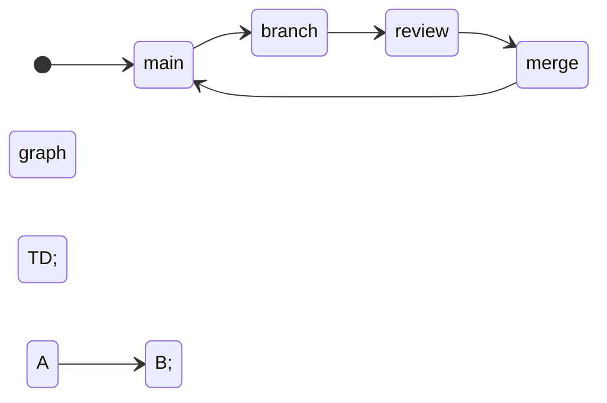

## infrastructure as code


Mermaid diagramming  
`https://mermaid-js.github.io/mermaid/#/`  

state diagram  
```
   stateDiagram
    direction LR  # set direction
    [*] --> main
    main --> branch
    branch --> review
    review --> merge
    merge --> main
```

code
```
