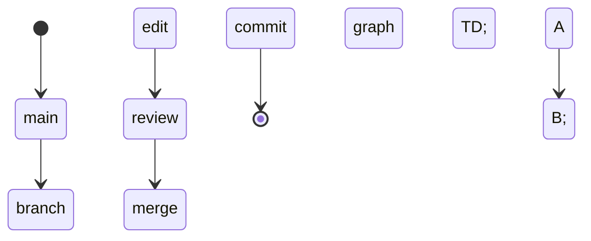

## infrastructure as code


Mermaid diagramming  
`https://mermaid-js.github.io/mermaid/#/`  


```mermaid
   stateDiagram
    [*] --> main
    main --> branch
    edit --> review
    review --> merge
    commit --> [*]
 ```


```mermaid
  graph TD;
      A-->B;
 ```

```
code
```
